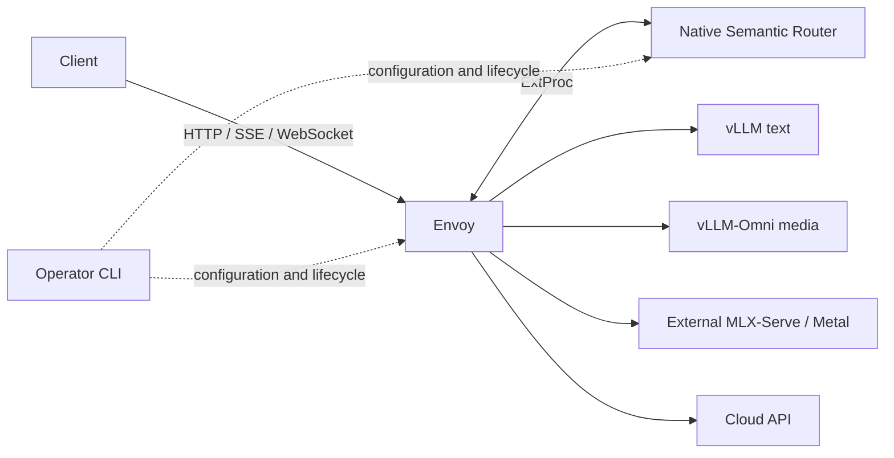

# inference-stack

[](https://github.com/omni-runtime/inference-stack/actions/workflows/ci.yml)
[](LICENSE)

**Deploy a capability-aware inference gateway across Kubernetes, Docker Compose,
and external model hosts.**

[简体中文](README.zh-CN.md) · [Getting started](docs/getting-started.md) ·
[Architecture](docs/architecture.md) · [Validation](docs/validation.md)

`inference-stack` is the deployment and operations side of Omni Runtime.
Envoy handles HTTP, SSE and WebSocket traffic; native vLLM Semantic Router
selects a compatible backend within the requested local/cloud scope.
The companion [semantic-router-multimodal](https://github.com/omni-runtime/semantic-router-multimodal)
repository owns the router patch set, native builds and release contract.

## What it provides

- Shared router/model configuration for **Kubernetes and Docker Compose**.
- Seven explicit combinations of local text, local multimodal and cloud pools.
- `auto`, `local-only` and `cloud-only` entrypoints with authentication and hard capability constraints.
- Managed vLLM/vLLM-Omni services or external backends on other machines.
- A hybrid example: Linux K8s gateway, NVIDIA text host and macOS Metal H3 host.
- Explicit deploy/start/stop/status/logs/test/down operations and persistent stop intent.
- Unit tests, mock gateway fixtures, real-backend probes and sanitized validation evidence.

Python runs only as an operator CLI. It does not proxy inference, choose models,
automatically free a GPU, or chain multiple model calls into a business workflow.

## Architecture



Capabilities belong to model cards, not engine names. Unsupported tasks fail
before dispatch. Multi-step tasks, such as image understanding followed by speech,
are separate requests initiated by the caller.

## Quick start: render without a cluster

Requires Python **3.12+**. This validates the example configuration without
creating resources, downloading model weights, or contacting model services.

```bash
git clone https://github.com/omni-runtime/inference-stack.git
cd inference-stack
python3 -m venv .venv
. .venv/bin/activate
python -m pip install -r requirements.lock
python scripts/deploy.py render --config examples/vllm-omni-cloud/stack.yaml --config-only
python -m unittest discover -s tests/unit -v
```

Inspect `generated/sample-vllm-omni-cloud/stack/`. To deploy, configure your own
kubeconfig and `stack.yaml` with hosts, backends and models, supply `secrets.env`,
and build/load a router image.
Follow the [deployment guide](docs/getting-started.md); the render command does
not establish deployment readiness.

> **Preview source release:** `0.1.0-preview.10`. The image digests in the contract
> describe locally built acceptance artifacts. They have **not** been published
> to a public image registry. Build/import an image using the companion project
> before running a gateway. No model weights or credentials are included.

## One deployment configuration

Maintain `instances/<name>/stack.yaml` and its referenced `secrets.env`.
The configuration declares hosts, gateway, backends, models and enabled routes.
All native runtime files are generated; project B supplies the pinned release
contract. Start with the [hybrid stack](examples/hybrid/stack.yaml) or one of the
seven pool examples. See [configuration and migration](docs/configuration.md).
`check`, `render` and `plan` with `--config` are offline; deployment and real
acceptance remain explicit operations. Legacy arguments remain compatible.

## Environments and protocols

| Example environment | Purpose |
| --- | --- |
| `kubernetes` | Linux cluster with optional NVIDIA-managed engines |
| `docker` | Compose services operated from a tools container |
| `hybrid` | K8s gateway with external text and MLX-Serve video hosts |

Addresses under `example.com`, `example.test` and `192.0.2.0/24` are placeholders.
Configure model IDs, declared capabilities and resource limits for your backend.

Native protocol families include chat, speech, image/audio generation, multipart
ASR/translation/image editing, synchronous/asynchronous video, MLX H3 video and
WebSocket sessions. Exact support depends on the router contract **and** the
registered engine/model. See [protocols and limits](docs/protocols.md).

## Validation status

The preview.10 implementation passed **48 mock gateway cases on AMD64 and 48 on
native ARM64**, real text/cloud suites on both deployments, and real H3 video
checks before and after an MLX restart. These are recorded acceptance runs, not
claims that every model, resolution or hardware combination works.
[Evidence and limitations](docs/validation.md) distinguish CI, mock tests and real inference.

## Documentation

- [Unified configuration and migration](docs/configuration.md)
- [Getting started and credential setup](docs/getting-started.md)
- [Architecture and ownership](docs/architecture.md)
- [Docker tools-container workflow](docs/docker.md)
- [macOS MLX-Serve hybrid deployment](docs/host-mlx.md)
- [Protocol support and limits](docs/protocols.md)
- [Validation and artifact provenance](docs/validation.md)
- [Changelog](CHANGELOG.md)

## Contributing and security

Read [CONTRIBUTING.md](CONTRIBUTING.md) and [community expectations](CODE_OF_CONDUCT.md).
Use issues for bugs and proposals. Report vulnerabilities privately as described
in [SECURITY.md](SECURITY.md).

## License and attribution

[Apache-2.0](LICENSE). See [NOTICE](NOTICE) for upstream attribution.
Model weights, inference engines and base images have their own licenses.
This is an independent integration project and is not an official vLLM release.
