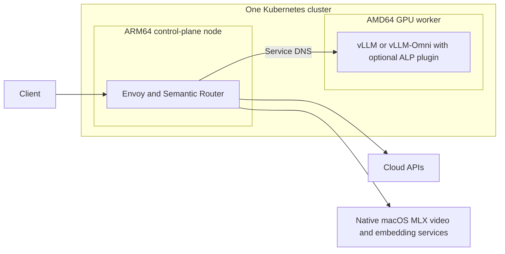

# One control plane, GPU workers

Declare one Kubernetes cluster in `stack.yaml`. Run the gateway on its control
plane node and managed NVIDIA backends on named workers. All manifests are applied
through the gateway's **single kubeconfig**. A worker is joined with `k3s agent`;
it does not run a second `k3s server` or a second gateway.



See [the cluster example](../examples/cluster/stack.yaml). `cluster.control_plane`
must match `gateway.host`, `gateway.platform` and `gateway.kubernetes.node`.
`cluster.workers` declares each worker's host, Kubernetes node name, reachable IP,
architecture, Flannel interface, GPU capacity, runtime class and read-only model
directory. A managed backend selects a worker with `deployment.node`. Its `host`
must identify the same machine. Router and Envoy remain pinned to the control
plane; engine images and resource requests belong to the worker.

Managed backend URLs use Kubernetes Service DNS, for example
`http://vllm.inference-stack.svc.cluster.local:8000/v1`. A NodePort may still be
declared for direct diagnostics. It is not how the gateway reaches its worker.
External Metal and cloud backends continue to use `deployment.mode: external`.

## Prepare and join

1. Prepare one Linux K3s control plane and a private kubeconfig. Install the exact
   `cluster.version` binary on each worker, and configure NVIDIA drivers/runtime.
   This project does not silently replace another cluster or install GPU drivers.
2. Verify bidirectional node connectivity, API reachability and the CNI network.
   For VXLAN this includes UDP 8472; an API TCP forward alone is insufficient.
   Use private networking such as ZeroTier and the declared interface on workers.
3. Obtain the control plane's agent join token privately. Keep it in a mode-0600
   file on the target worker; never put it in `stack.yaml`, Git or CLI arguments.
4. Synchronize the stack sources and configuration to the worker. Render first:

   ```bash
   python scripts/cluster.py --config instances/demo/stack.yaml render-worker --worker text
   ```

5. On that worker, as root, join using a new private backup directory:

   ```bash
   python scripts/cluster.py --config instances/demo/stack.yaml install-worker \
     --worker text --token-file /private/agent-token --backup /private/cluster-backup
   ```

   The command checks the installed version, machine architecture and node IP on
   the declared interface. It refuses an active independent K3s server/agent. It
   installs `inference-stack-agent.service` with a separate data directory and
   keeps the join token in a private file. Repeating an identical active-worker
   installation is harmless; replacing an active worker's identity is rejected.
   The custom `inference-stack/worker` label is set at registration. Optional
   `node-role.kubernetes.io/worker` labels must be applied by a cluster administrator;
   recent kubelets reject those reserved labels at startup.
6. Install a pinned NVIDIA device-plugin DaemonSet on the GPU worker, then deploy
   from the control plane using the normal unified configuration commands:

   ```bash
   python scripts/credentials.py --config instances/demo/stack.yaml
   python scripts/deploy.py deploy --config instances/demo/stack.yaml
   python scripts/cluster.py --config instances/demo/stack.yaml check
   ```

The check reads both nodes from one API server and verifies Ready state, roles,
version, architecture, addresses and GPU capacity. Validate a real cross-node
model request and pod DNS after joining. `render` alone cannot prove connectivity.

## macOS control-plane hosts

macOS runs the control plane in a Linux VM, such as Colima. MLX Metal inference
stays on the macOS host. Declare the **VM's** reachable address as the control
plane node, and pin the VM's API port. Workers need a route through the macOS
private-network address to that VM. The VM needs a return route to worker IPs;
macOS forwarding and those routes must persist across restarts. The VM address
must remain stable. Do not confuse a macOS management SSH address with a K8s node
address, or use the user's unrelated LAN address as a worker identity.

## Existing clusters and data

Before converting an existing server into a worker, back up its datastore, TLS,
configuration, workload manifests, node-local volumes and image cache. Include
the pod sandbox (`pause`) image if registry access is unavailable. Stop data
writers before the final data snapshot. Preserve the old server and data
directories for rollback; do not use an uninstall command to migrate them.

Restore other workloads with their original replicas and data paths. Retain PVC
bindings and constrain node-local PVs to the worker. Existing independent server
databases cannot be merged by simply giving `k3s server` another token.

New managed workers receive backend-specific cache and output PVCs. For migrated
data, declare both claims explicitly:

```yaml
deployment:
  mode: managed
  node: text
  image: omni
  command: [vllm, serve, /models/text]
  existing_claims:
    cache: retained-text-cache
    outputs: retained-text-outputs
```

The renderer references these claims without recreating them or clearing their
immutable storage-class/volume bindings. They must already exist in the gateway
namespace and be accessible on the selected worker. Credentials, tokens, private
fleet configuration and verification reports remain outside published source.

## Optional cloud ALP

`alp` in the same `stack.yaml` declares the SR contract worker, mounted private
dependency directory, catalog path, signing-key **environment name**, timeout and
enabled cloud model policies. The actual key belongs in `secrets.file`. Rendering
produces the SR `global.integrations.alp` section and read-only worker mount.
Select a release that implements `alp_chat`; merely enabling configuration on an
older image is insufficient.

`alp.projection: typed` passes the operation payload as an object in native
Function Calling. The default `api_json` keeps the legacy once-encoded
`payload_json` envelope and omits the new CLI flag for older workers. Typed mode
requires a worker version with `--projection typed` support. It exposes the
shared ALP and host task constraints in native tool parameters and retains full
post-generation validation.

`alp.request_strict: true` optionally adds `--request-strict`. Its default is
false; this is a provider request, not an enforcement guarantee. Evaluate it
against the actual cloud backend. Changing projection requires new private
provider sessions. Worker dependencies remain operator-installed and are not
bundled in the router image.

The worker imports separately authorized private `vllm-alp` and `alp_schema_mcp`
dependencies; this public repository does not distribute them. See
[SR native ALP](https://github.com/omni-runtime/semantic-router-multimodal/blob/main/docs/alp-native.md)
for dependency preparation, signed tasks, provider limitations and private replay.
It validates protocol data without dispatching HTTP or executing agent actions.
Keep one router replica or use sticky routing because replay is process-local.

References: [K3s agent options](https://docs.k3s.io/cli/agent),
[K3s networking](https://docs.k3s.io/networking/basic-network-options),
[K3s requirements](https://docs.k3s.io/installation/requirements).
